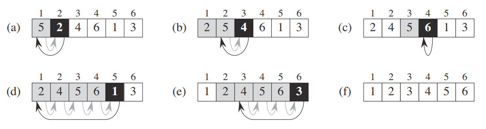

----------
#### 插入排序（Insertion Sort）
插入排序（Insertion-Sort）的算法描述是一种简单直观的排序算法。打过扑克牌的应该都会明白（当然，如果你说你打扑克牌摸牌的时候从来不按牌的大小整理牌，那我只能呵呵了）

##### 1. 基本思想
插入排序的工作原理是通过构建有序序列，对于未排序数据，在已排序序列中从后向前扫描，找到相应位置并插入。插入排序在实现上，通常采用in-place排序（即只需用到O(1)的额外空间的排序），因而在从后向前扫描过程中，需要反复把已排序元素逐步向后挪位，为最新元素提供插入空间。

趣味解释：


插入排序操作类似于摸牌并将其从大到小排列。每次摸到一张牌后，根据其点数插入到确切位置。

如上图：表示的是摸到草花7后进行插入的过程。忽略最右边的草花10，相当于一开始7在最右边，然后逐个与左边的排相比较(当然左边的牌早已排好顺序)，将其放置在合适的位置。当摸到草花10后重复上述过程即可。

而实际中，如何将插入牌的这个过程应用到实际排序操作中呢？具体我们以一组数字来说操作说明：



例如我们有一组数字：｛5，2，4，6，1，3｝，我们要将这组数字从小到大进行排列。 我们从第二个数字开始，将其认为是新增加的数字，这样第二个数字只需与其左边的第一个数字比较后排好序；在第三个数字，认为前两个已经排好序的数字为手里整理好的牌，那么只需将第三个数字与前两个数字比较即可；以此类推，直到最后一个数字与前面的所有数字比较结束，插入排序完成。

##### 2. 实现逻辑

> ① 从第一个元素开始，该元素可以认为已经被排序
>
> ② 取出下一个元素，在已经排序的元素序列中从后向前扫描
>
> ③如果该元素（已排序）大于新元素，将该元素移到下一位置
>
> ④ 重复步骤③，直到找到已排序的元素小于或者等于新元素的位置
>
> ⑤将新元素插入到该位置后
>
> ⑥ 重复步骤②~⑤

##### 3. 动图演示


##### 4. 性能分析

> 平均时间复杂度：O(N^2)
>
> 最差时间复杂度：O(N^2)
>
> 空间复杂度：O(1)
>
> 排序方式：In-place
>
> 稳定性：稳定

如果插入排序的目标是把n个元素的序列升序排列，那么采用插入排序存在最好情况和最坏情况：

> (1) 最好情况：序列已经是升序排列，在这种情况下，需要进行的比较操作需(n-1)次即可。
>
> (2) 最坏情况：序列是降序排列，那么此时需要进行的比较共有n(n-1)/2次。

插入排序的赋值操作是比较操作的次数减去(n-1)次。平均来说插入排序算法复杂度为O(N^2)。

最优的空间复杂度为开始元素已排序，则空间复杂度为 0；

最差的空间复杂度为开始元素为逆排序，则空间复杂度最坏时为 O(N);

平均的空间复杂度为O(1)

```
注：
n：数据规模
k：”桶”的个数
In-place：占用常数内存，不占用额外内存
Out-place：占用额外内存
```

##### 5. 代码实现（C++版）

```
// 插入排序
void InsertSort(int arr[], int len){
	// 检查数据合法性
	if(arr == NULL || len <= 0){
	    return;
	}
	for(int i = 1; i < len; i++){
	    int tmp = arr[i];
		int j;
		for(j = i-1; j >= 0; j--){
			//如果比tmp大把值往后移动一位
			if(arr[j] > tmp){
			   arr[j+1] = arr[j];
			}
			else{
			   break;
			}
		}
		arr[j+1] = tmp;
	}
}
```

##### 6. 算法优化改进
###### 6.1 改进方法①
场景分析：
直接插入排序每次往前插入时，是按顺序依次往前查找，数据量较大时，必然比较耗时，效率低。

改进思路：
在往前找合适的插入位置时采用二分查找的方式，即折半插入。

二分插入排序相对直接插入排序而言：平均性能更快，时间复杂度降至O(NlogN)，排序是稳定的，但排序的比较次数与初始序列无关，相比直接插入排序，在速度上有一定提升。逻辑步骤：

> ① 从第一个元素开始，该元素可以认为已经被排序
>
> ② 取出下一个元素，在已经排序的元素序列中二分查找到第一个比它大的数的位置
>
> ③将新元素插入到该位置后
>
> ④ 重复上述两步

改进代码（C++版）：

```
// 插入排序改进：二分插入排序
void BinaryInsertSort(int arr[], int len)   
{   
    int key, left, right, middle;   
    for (int i=1; i<len; i++)   
    {   
        key = a[i];   
        left = 0;   
        right = i-1;   
        while (left<=right)   
        {   
            middle = (left+right)/2;   
            if (a[middle]>key)   
                right = middle-1;   
            else   
				left = middle+1;   
        }   

        for(int j=i-1; j>=left; j--)   
        {   
            a[j+1] = a[j];   
        }   

        a[left] = key;          
    }   
}
```

###### 6.2 改进方法②

场景分析：
(1) 插入排序对几乎已排好序的数据操作时，效率很高，可以达到线性排序的效率。
(2) 插入排序在每次往前插入时只能将数据移动一位，效率比较低。

改进思路：
先将整个待排元素序列分割成若干个子序列（由相隔某个“增量”的元素组成的）分别进行直接插入排序，然后依次缩减增量再进行排序，待整个序列中的元素基本有序（增量足够小）时，再对全体元素进行一次直接插入排序。

改进思路二的方法实际上就是希尔排序。在这里只给出思路，在后续系列《算法：排序算法之希尔排序》中再做具体讲解说明。

----------

#### 总结
插入排序不适合对于数据量比较大的排序应用。但是，如果需要排序的数据量很小，例如，量级小于千，那么插入排序还是一个不错的选择。尤其当数据基本有序时，采用插入排序可以明显减少数据交换和数据移动次数，进而提升排序效率。 在STL的sort算法和stdlib的qsort算法中，都将插入排序作为快速排序的补充，用于少量元素的排序。

---
---
**PS**: 更多资源，欢迎关注微信公众号：developer1024


