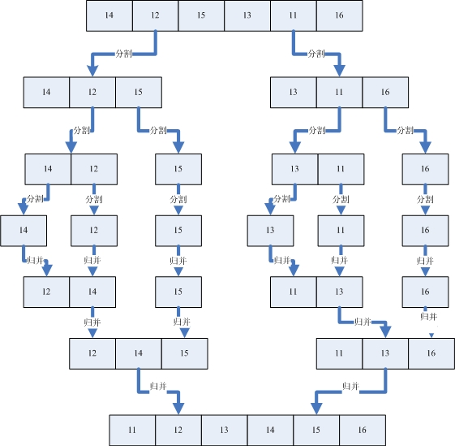

----------

#### 归并排序（Merge Sort）
归并排序，是创建在归并操作上的一种有效的排序算法。算法是采用分治法（Divide and Conquer）的一个非常典型的应用，且各层分治递归可以同时进行。归并排序思路简单，速度仅次于快速排序，为稳定排序算法，一般用于对总体无序，但是各子项相对有序的数列。

##### 1. 基本思想
归并排序是用分治思想，分治模式在每一层递归上有三个步骤：

> - **分解（Divide）**：将n个元素分成个含n/2个元素的子序列。
> - **解决（Conquer）**：用合并排序法对两个子序列递归的排序。
> - **合并（Combine）**：合并两个已排序的子序列已得到排序结果。

##### 2. 实现逻辑
**2.1 迭代法**

> - ①申请空间，使其大小为两个已经排序序列之和，该空间用来存放合并后的序列
> - ②设定两个指针，最初位置分别为两个已经排序序列的起始位置
> - ③比较两个指针所指向的元素，选择相对小的元素放入到合并空间，并移动指针到下一位置
> - ④重复步骤③直到某一指针到达序列尾
> - ⑤将另一序列剩下的所有元素直接复制到合并序列尾

**2.2 递归法**

> - ①将序列每相邻两个数字进行归并操作，形成floor(n/2)个序列，排序后每个序列包含两个元素
> - ②将上述序列再次归并，形成floor(n/4)个序列，每个序列包含四个元素
> - ③重复步骤②，直到所有元素排序完毕

##### 3. 动图演示


具体的我们以一组无序数列｛14，12，15，13，11，16｝为例分解说明，如下图所示：



上图中首先把一个未排序的序列从中间分割成2部分，再把2部分分成4部分，依次分割下去，直到分割成一个一个的数据，再把这些数据两两归并到一起，使之有序，不停的归并，最后成为一个排好序的序列。

##### 4. 复杂度分析

> - 平均时间复杂度：O(nlogn)
> - 最佳时间复杂度：O(n)
> - 最差时间复杂度：O(nlogn)
> - 空间复杂度：O(n)
> - 排序方式：In-place
> - 稳定性：稳定

不管元素在什么情况下都要做这些步骤，所以花销的时间是不变的，所以该算法的最优时间复杂度和最差时间复杂度及平均时间复杂度都是一样的为：O( nlogn )

归并的空间复杂度就是那个临时的数组和递归时压入栈的数据占用的空间：n + logn；所以空间复杂度为: O(n)。

归并排序算法中，归并最后到底都是相邻元素之间的比较交换，并不会发生相同元素的相对位置发生变化，故是稳定性算法。

##### 5. 代码实现
**5.1 C版本**
迭代法：

```
// 归并排序（C-迭代版）
int min(int x, int y) {
	return x < y ? x : y;
}
void merge_sort(int arr[], int len) {
	int* a = arr;
	int* b = (int*) malloc(len * sizeof(int));
	int seg, start;
	for (seg = 1; seg < len; seg += seg) {
		for (start = 0; start < len; start += seg + seg) {
			int low = start, mid = min(start + seg, len), high = min(start + seg + seg, len);
			int k = low;
			int start1 = low, end1 = mid;
			int start2 = mid, end2 = high;
			while (start1 < end1 && start2 < end2)
				b[k++] = a[start1] < a[start2] ? a[start1++] : a[start2++];
			while (start1 < end1)
				b[k++] = a[start1++];
			while (start2 < end2)
				b[k++] = a[start2++];
		}
		int* temp = a;
		a = b;
		b = temp;
	}
	if (a != arr) {
		int i;
		for (i = 0; i < len; i++)
			b[i] = a[i];
		b = a;
	}
	free(b);
}
```

递归法：

```
// 归并排序（C-递归版）
void merge_sort_recursive(int arr[], int reg[], int start, int end) {
	if (start >= end)
		return;
	int len = end - start, mid = (len >> 1) + start;
	int start1 = start, end1 = mid;
	int start2 = mid + 1, end2 = end;
	merge_sort_recursive(arr, reg, start1, end1);
	merge_sort_recursive(arr, reg, start2, end2);
	int k = start;
	while (start1 <= end1 && start2 <= end2)
		reg[k++] = arr[start1] < arr[start2] ? arr[start1++] : arr[start2++];
	while (start1 <= end1)
		reg[k++] = arr[start1++];
	while (start2 <= end2)
		reg[k++] = arr[start2++];
	for (k = start; k <= end; k++)
		arr[k] = reg[k];
}
void merge_sort(int arr[], const int len) {
	int reg[len];
	merge_sort_recursive(arr, reg, 0, len - 1);
}
```

**5.2 C++版本**
迭代法：

```
// 归并排序（C++-迭代版）
// 整數或浮點數皆可使用,若要使用物件(class)時必須設定"小於"(<)的運算子功能
template<typename T>
void merge_sort(T arr[], int len) {
	T* a = arr;
	T* b = new T[len];
	for (int seg = 1; seg < len; seg += seg) {
		for (int start = 0; start < len; start += seg + seg) {
			int low = start, mid = min(start + seg, len), high = min(start + seg + seg, len);
			int k = low;
			int start1 = low, end1 = mid;
			int start2 = mid, end2 = high;
			while (start1 < end1 && start2 < end2)
				b[k++] = a[start1] < a[start2] ? a[start1++] : a[start2++];
			while (start1 < end1)
				b[k++] = a[start1++];
			while (start2 < end2)
				b[k++] = a[start2++];
		}
		T* temp = a;
		a = b;
		b = temp;
	}
	if (a != arr) {
		for (int i = 0; i < len; i++)
			b[i] = a[i];
		b = a;
	}
	delete[] b;
```

递归法：

```
// 归并排序（C++-递归版）
template<typename T>
void merge_sort_recursive(T arr[], T reg[], int start, int end) {
	if (start >= end)
		return;
	int len = end - start, mid = (len >> 1) + start;
	int start1 = start, end1 = mid;
	int start2 = mid + 1, end2 = end;
	merge_sort_recursive(arr, reg, start1, end1);
	merge_sort_recursive(arr, reg, start2, end2);
	int k = start;
	while (start1 <= end1 && start2 <= end2)
		reg[k++] = arr[start1] < arr[start2] ? arr[start1++] : arr[start2++];
	while (start1 <= end1)
		reg[k++] = arr[start1++];
	while (start2 <= end2)
		reg[k++] = arr[start2++];
	for (k = start; k <= end; k++)
		arr[k] = reg[k];
}
//整數或浮點數皆可使用,若要使用物件(class)時必須設定"小於"(<)的運算子功能
template<typename T>
void merge_sort(T arr[], const int len) {
	T reg[len];
	merge_sort_recursive(arr, reg, 0, len - 1);
}

```

**5.3 Java版本**
迭代法：

```
// 归并排序（Java-迭代版）
public static void merge_sort(int[] arr) {
    int len = arr.length;
    int[] result = new int[len];
    int block, start;

    // 原版代码的迭代次数少了一次，没有考虑到奇数列数组的情况
    for(block = 1; block < len*2; block *= 2) {
        for(start = 0; start <len; start += 2 * block) {
            int low = start;
            int mid = (start + block) < len ? (start + block) : len;
            int high = (start + 2 * block) < len ? (start + 2 * block) : len;
            //两个块的起始下标及结束下标
            int start1 = low, end1 = mid;
            int start2 = mid, end2 = high;
            //开始对两个block进行归并排序
            while (start1 < end1 && start2 < end2) {
	        result[low++] = arr[start1] < arr[start2] ? arr[start1++] : arr[start2++];
            }
            while(start1 < end1) {
	        result[low++] = arr[start1++];
            }
            while(start2 < end2) {
	        result[low++] = arr[start2++];
            }
        }
	int[] temp = arr;
	arr = result;
	result = temp;
    }
    result = arr;       
}
```

递归法：

```
// 归并排序（Java-递归版）
static void merge_sort_recursive(int[] arr, int[] result, int start, int end) {
	if (start >= end)
		return;
	int len = end - start, mid = (len >> 1) + start;
	int start1 = start, end1 = mid;
	int start2 = mid + 1, end2 = end;
	merge_sort_recursive(arr, result, start1, end1);
	merge_sort_recursive(arr, result, start2, end2);
	int k = start;
	while (start1 <= end1 && start2 <= end2)
		result[k++] = arr[start1] < arr[start2] ? arr[start1++] : arr[start2++];
	while (start1 <= end1)
		result[k++] = arr[start1++];
	while (start2 <= end2)
		result[k++] = arr[start2++];
	for (k = start; k <= end; k++)
		arr[k] = result[k];
}
public static void merge_sort(int[] arr) {
	int len = arr.length;
	int[] result = new int[len];
	merge_sort_recursive(arr, result, 0, len - 1);
}
```

##### 6. 优化改进
在规模较小时，合并排序可采用直接插入，避免递归调用；
在写法上，可以在生成辅助数组时，俩头小，中间大，这时不需要再在后边加俩个while循环进行判断，只需一次比完。
为了节省将元素复制到辅助数组作用的时间，可以在递归调用的每个层次交换原始数组与辅助数组的角色。

----------

#### 总结
归并排序和选择排序一样，归并排序的性能不受输入数据的影响，但表现比选择排序好的多，因为始终都是O(n log n）的时间复杂度。代价是需要额外的内存空间。

---
---
**PS**: 更多资源，欢迎关注微信公众号：developer1024


