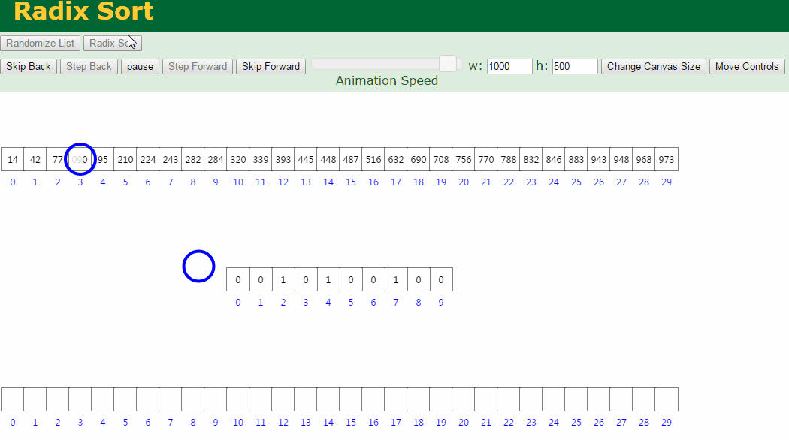

----------

#### 基数排序（RadixSort）
基数排序（Radix sort）是一种非比较型整数排序算法。

##### 1. 基本思想
原理是将整数按位数切割成不同的数字，然后按每个位数分别比较。基数排序的方式可以采用LSD（Least significant digital）或MSD（Most significant digital），LSD的排序方式由键值的最右边开始，而MSD则相反，由键值的最左边开始。

> - MSD：先从高位开始进行排序，在每个关键字上，可采用计数排序
> - LSD：先从低位开始进行排序，在每个关键字上，可采用桶排序

##### 2. 实现逻辑

> - 将所有待比较数值（正整数）统一为同样的数位长度，数位较短的数前面补零。
> - 从最低位开始，依次进行一次排序。
> - 这样从最低位排序一直到最高位排序完成以后, 数列就变成一个有序序列。

##### 3. 动图演示



分步图示说明：设有数组 array = {53, 3, 542, 748, 14, 214, 154, 63, 616}，对其进行基数排序：


在上图中，首先将所有待比较数字统一为统一位数长度，接着从最低位开始，依次进行排序。

> - 按照个位数进行排序。
> - 按照十位数进行排序。
> - 按照百位数进行排序。

排序后，数列就变成了一个有序序列。

##### 4. 复杂度分析

> - 时间复杂度：O(k*N)
> - 空间复杂度：O(k + N)
> - 稳定性：稳定

设待排序的数组R[1..n]，数组中最大的数是d位数，基数为r（如基数为10，即10进制，最大有10种可能，即最多需要10个桶来映射数组元素）。

处理一位数，需要将数组元素映射到r个桶中，映射完成后还需要收集，相当于遍历数组一遍，最多元素数为n，则时间复杂度为O(n+r)。所以，总的时间复杂度为O(d*(n+r))。

基数排序过程中，用到一个计数器数组，长度为r，还用到一个r*n的二位数组来做为桶，所以空间复杂度为O(r*n)。

基数排序基于分别排序，分别收集，所以是稳定的。

##### 5. 代码实现（C++版）

```
int maxbit(int data[], int n) //辅助函数，求数据的最大位数
{
    int maxData = data[0];		///< 最大数
    /// 先求出最大数，再求其位数，这样有原先依次每个数判断其位数，稍微优化点。
    for (int i = 1; i < n; ++i)
    {
        if (maxData < data[i])
            maxData = data[i];
    }
    int d = 1;
    int p = 10;
    while (maxData >= p)
    {
        //p *= 10; // Maybe overflow
        maxData /= 10;
        ++d;
    }
    return d;
/*    int d = 1; //保存最大的位数
    int p = 10;
    for(int i = 0; i < n; ++i)
    {
        while(data[i] >= p)
        {
            p *= 10;
            ++d;
        }
    }
    return d;*/
}
void radixsort(int data[], int n) //基数排序
{
    int d = maxbit(data, n);
    int *tmp = new int[n];
    int *count = new int[10]; //计数器
    int i, j, k;
    int radix = 1;
    for(i = 1; i <= d; i++) //进行d次排序
    {
        for(j = 0; j < 10; j++)
            count[j] = 0; //每次分配前清空计数器
        for(j = 0; j < n; j++)
        {
            k = (data[j] / radix) % 10; //统计每个桶中的记录数
            count[k]++;
        }
        for(j = 1; j < 10; j++)
            count[j] = count[j - 1] + count[j]; //将tmp中的位置依次分配给每个桶
        for(j = n - 1; j >= 0; j--) //将所有桶中记录依次收集到tmp中
        {
            k = (data[j] / radix) % 10;
            tmp[count[k] - 1] = data[j];
            count[k]--;
        }
        for(j = 0; j < n; j++) //将临时数组的内容复制到data中
            data[j] = tmp[j];
        radix = radix * 10;
    }
    delete []tmp;
    delete []count;
}
```

----------

#### 总结
基数排序与计数排序、桶排序这三种排序算法都利用了桶的概念，但对桶的使用方法上有明显差异：

> - 基数排序：根据键值的每位数字来分配桶；
> - 计数排序：每个桶只存储单一键值；
> - 桶排序：每个桶存储一定范围的数值；

基数排序不是直接根据元素整体的大小进行元素比较，而是将原始列表元素分成多个部分，对每一部分按一定的规则进行排序，进而形成最终的有序列表。
