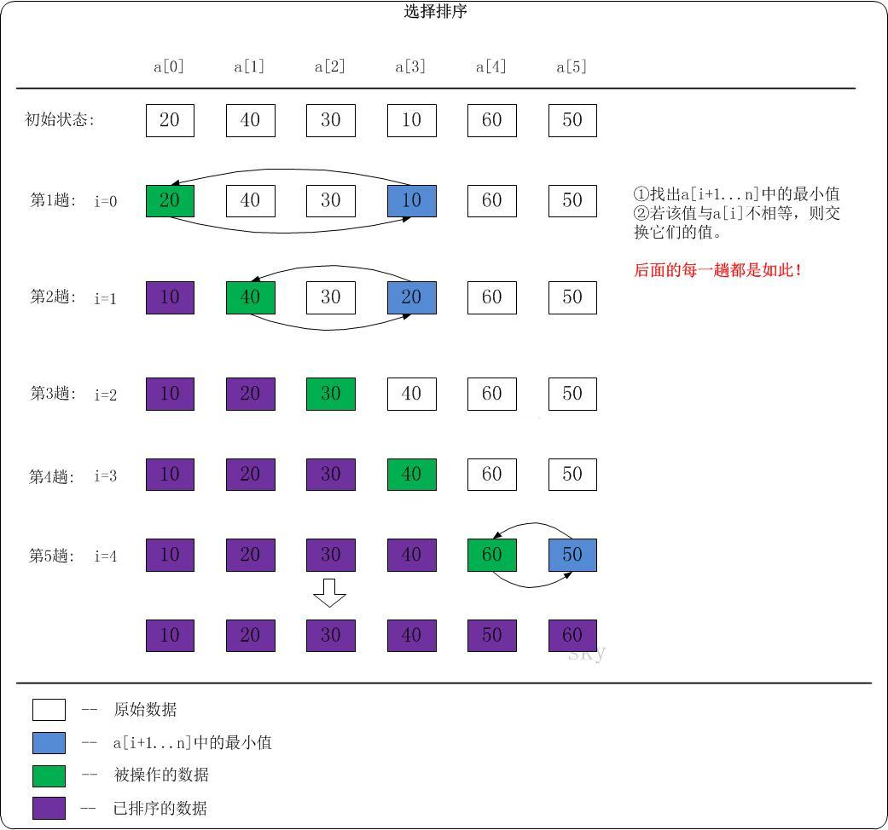

----------

#### 选择排序（Selection Sort）
选择排序(Selection sort)是一种简单直观的排序算法。

##### 1. 基本思想
首先在未排序序列中找到最小（大）元素，存放到排序序列的起始位置，然后，再从剩余未排序元素中继续寻找最小（大）元素，然后放到已排序序列的末尾。以此类推，直到所有元素均排序完毕。

选择排序的思想其实和冒泡排序有点类似，都是在一次排序后把最小的元素放到最前面，或者将最大值放在最后面。但是过程不同，冒泡排序是通过相邻的比较和交换。而选择排序是通过对整体的选择，每一趟从前往后查找出无序区最小值，将最小值交换至无序区最前面的位置。

##### 2. 实现逻辑

> - 第一轮从下标为 1 到下标为 n-1 的元素中选取最小值，若小于第一个数，则交换
> - 第二轮从下标为 2 到下标为 n-1 的元素中选取最小值，若小于第二个数，则交换
> - 依次类推下去……

##### 3. 动图演示


注：红色表示当前最小值，黄色表示已排序序列，绿色表示当前位置。

具体的我们以一组无序数列｛20，40，30，10，60，50｝为例分解说明，如下图所示：



##### 4. 复杂度分析

> - 平均时间复杂度：O(N^2)
> - 最佳时间复杂度：O(N^2)
> - 最差时间复杂度：O(N^2)
> - 空间复杂度：O(1)
> - 排序方式：In-place
> - 稳定性：不稳定

选择排序的交换操作介于和(n-1)次之间。选择排序的比较操作为n(n-1)/2次之间。选择排序的赋值操作介于0和3(n-1)次之间。

比较次数O(n^2)，比较次数与关键字的初始状态无关，总的比较次数N = (n-1) + (n-2) +…+ 1 = n x (n-1)/2。交换次数O(n)，最好情况是，已经有序，交换0次；最坏情况是，逆序，交换n-1次。

##### 5. 代码实现
**C版本：**

```
// 选择排序（C）
void selection_sort(int arr[], int len) {
	int i, j, min, temp;
	for (i = 0; i < len - 1; i++) {
		min = i;
		for (j = i + 1; j < len; j++)
			if (arr[min] > arr[j])
				min = j;
	   	temp = arr[min];
		arr[min] = arr[i];
		arr[i] = temp;
	}
}
```

**C++版本：**

```
// 选择排序（C++）
// 整數或浮点数皆可使用，若要使用物件（class）時必須設定大于（>）的运算子功能
template<typename T>
void selection_sort(T arr[], int len) {
	int i, j, min;
	for (i = 0; i < len - 1; i++) {
		min = i;
		for (j = i + 1; j < len; j++)
			if (arr[min] > arr[j])
				min = j;
		swap(arr[i], arr[min]);
	}
}
```

**Java版本：**

```
// 选择排序（Java）
public static void selection_sort(int[] arr) {
	int i, j, min, temp, len = arr.length;
	for (i = 0; i < len - 1; i++) {
		min = i;
		for (j = i + 1; j < len; j++)
			if (arr[min] > arr[j])
				min = j;
		temp = arr[min];
		arr[min] = arr[i];
		arr[i] = temp;
	}
}
```

##### 6. 优化改进
**①二元选择排序**
改进思路：
简单选择排序，每趟循环只能确定一个元素排序后的定位。根据之前冒泡排序的经验，我们可以考虑改进为每趟循环确定两个元素（当前趟最大和最小记录）的位置,从而减少排序所需的循环次数。改进后对n个数据进行排序，最多只需进行[n/2]趟循环即可。

**②堆排序**
堆排序是一种树形选择排序，是对直接选择排序的有效改进。具体的分析我们留到后面讲堆排序时再详细说明。

----------

#### 总结
选择排序的主要优点与数据移动有关。如果某个元素位于正确的最终位置上，则它不会被移动。选择排序每次交换一对元素，它们当中至少有一个将被移到其最终位置上，因此对n个元素的表进行排序总共进行至多n-1次交换。在所有的完全依靠交换去移动元素的排序方法中，选择排序属于非常好的一种。
